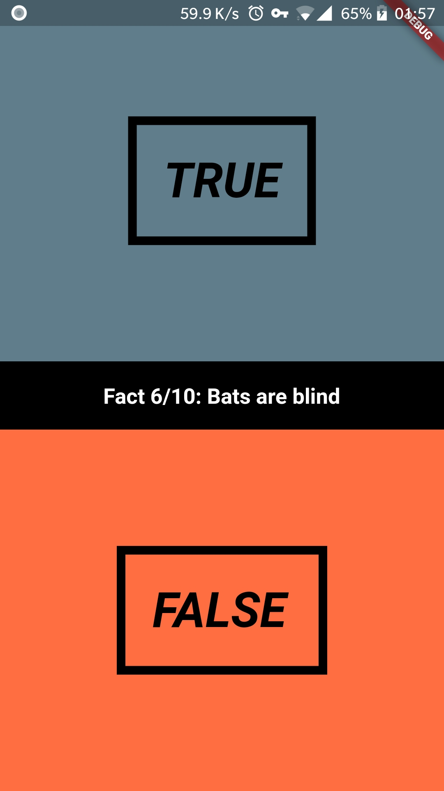
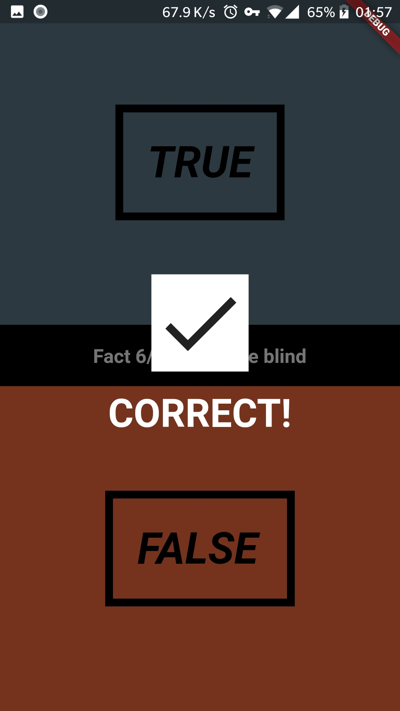
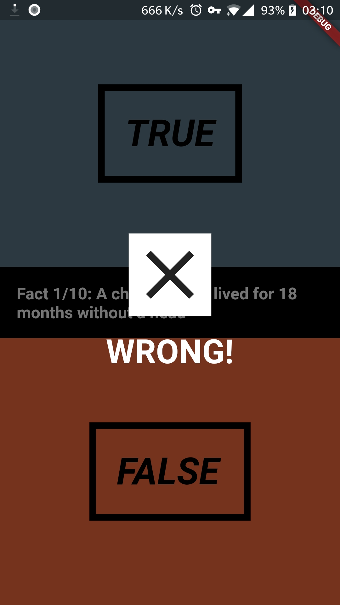

# Quizzy Flutter/Dart rakendus

#### Mobiilirakenduste Arendamine 2. Iseseisev Töö - Kert Tamm

## Projekti seadistamine Android Studiole

### Dart SDK installeerimine:
https://www.dartlang.org/tools/sdk
Lihtne kasutajaliidesega teostatav installeerimine. Kõik on kasutaja eest juba tehtud ja pole vaja teha muud kui vajutada next'e ja korras.

### Flutter SDK installeerimine:
https://flutter.dev/docs/get-started/install/windows
Lae alla flutteri zip fail. -> paki zip lahti ja paiguta lahti pakitud flutteri kaust näiteks asukohta C://src/flutter. 
#### NB! Program Files'i alamkaustadesse ei soovita paigutada, kuna seal nõutakse rohkem õigusi ja SDK ei pruugi soovitud viisil töötada.

### Dart ja Flutter plugin'ide installimine android studiosse:
Android Studio -> Settings -> Plugins -> Vajuta Search in repositories -> otsinguribalt flutter -> install flutter -> kliki nõusolekut installida korraga ka Dart plugin või tee seda eraldi

### Android Studios kontrolli üle ka SDK'de teekonnad:
Dart:
Android Studio -> File -> Settings -> Languages & Frameworks -> Dart -> Dart SDK Path -> vaikimisi asukoht on C:\src\flutter\bin\cache\dart-sdk
Lisaks kontrolli ka et oleks linnuke kastis "Enable Dart support for the project 'app_name'

Flutter:
Android Studio -> File -> Settings -> Languages & Frameworks -> Flutter -> Flutter SDK Path -> kui järgisite eelnevat installeerimise juhendit, siis asukoht on C:\src\flutter, juhul kui mitte, siis muutke asukoht selleks, kuhu paigutasite lahti pakitud flutter'i kausta.

### Kasutatud allikad: 

#### YouTube: 
Bram Vanbilsen - https://youtu.be/jBBl1tYkUnE

#### Github demo repository: 
Bram Vanbilsen - https://github.com/bramvbilsen/Flutter-Quiz-Preview-App

### Arvamus juhendist:
Juhend oli minu arvates väga hästi tehtud. Juhendi looja seletas tehtavad sammud hästi läbi ja üleüldiselt tundus, et kogu protsess möödus sujuvalt. Juhendis oli ka hästi ära seletatud mida miski element teeb ja kuidas elemendid eri viisidel käituvad. Lisaks kõigele olid klassid ja nendes olev lahti seletatud ja koodi vaadates on üpris lihtsalt aru saada kus miski paikneb ja mida miski teeb.

### Kirjeldus muutustest rakenduse terviklikumaks muutmiseks:
Sai muudetud natukene graafilisi elemente enda nägemise järgi ja lisatud ka küsimusi ning tekstielemente ja lisaks nende paigutust muudetud.

### Screenshotid:

